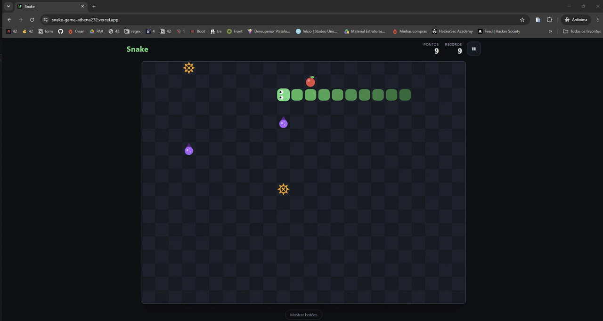
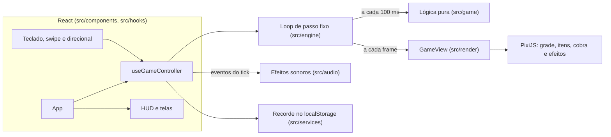

# Snake

[](https://github.com/athena272/snake-game/actions/workflows/ci.yml)

Releitura moderna do clássico Snake, jogável direto no navegador, no computador ou no celular. A lógica do jogo é TypeScript puro e testado, a renderização usa PixiJS (WebGL) a 60 fps e a interface é feita em React.

**Jogue agora:** [snake-game-athena272.vercel.app](https://snake-game-athena272.vercel.app/)



## Regras

- A cobra anda sozinha numa grade de **24 × 18** células, a cada **100 ms**.
- As bordas dão a volta: sair por um lado faz a cobra entrar pelo lado oposto.
- 🍎 **Maçã:** a cobra cresce 1 segmento e a maçã reaparece em outra célula livre.
- 🟣 **Veneno (2):** a cobra encolhe 1 segmento e o veneno muda de lugar. Se ela chegar a zero segmentos, o jogo acaba.
- 🟠 **Armadilha (2):** fim de jogo imediato.
- Bater no próprio corpo também encerra a partida.
- A pontuação é o tamanho da cobra menos a cabeça. O recorde fica salvo no navegador.
- Se a cobra ocupar todas as células livres, você vence.

Itens nunca nascem em cima da cobra nem de outros itens, e a área logo à frente da posição inicial começa sempre livre.

## Controles

| Ação               | Teclado                                   | Celular                                                        |
| ------------------ | ----------------------------------------- | -------------------------------------------------------------- |
| Mover              | Setas, `W` `A` `S` `D` ou `H` `J` `K` `L` | Deslizar o dedo sobre o tabuleiro ou usar o direcional na tela |
| Pausar / continuar | `P` ou `Esc`                              | Botão "Pausar" no topo                                         |
| Jogar / reiniciar  | `Enter` ou `Espaço`                       | Botões na tela                                                 |
| Ligar / tirar som  | `M`                                       | Botão de som no topo                                           |

O direcional na tela aparece por padrão em telas de toque e pode ser mostrado ou escondido a qualquer momento. O jogo pausa sozinho quando a aba fica oculta. Os efeitos sonoros começam ligados, e a escolha de som e do direcional fica salva no navegador.

## Stack

- [Vite](https://vite.dev/) + [React 19](https://react.dev/) + [TypeScript](https://www.typescriptlang.org/) em modo `strict`
- [PixiJS v8](https://pixijs.com/) para a renderização em WebGL
- [Vitest](https://vitest.dev/) + [Testing Library](https://testing-library.com/) para os testes
- ESLint (regras com checagem de tipos) + Prettier
- GitHub Actions para CI e Vercel para hospedagem
- Node 24 e pnpm

## Arquitetura

O código é separado em camadas com dependências em um único sentido: a lógica do jogo não conhece React nem Pixi, e o React só conversa com o renderer por meio de uma interface.



- **`src/game`**: estado imutável e função `step(state)` determinística, que devolve o novo estado e os eventos do tick (`ate`, `poisoned`, `died`, `won`). A aleatoriedade vem de um gerador com semente guardada no próprio estado, então qualquer partida pode ser reproduzida nos testes.
- **`src/engine`**: loop com passo fixo. A lógica roda exatamente a cada 100 ms, independente da taxa de quadros, e o renderer recebe um fator de interpolação para desenhar o movimento suave entre dois ticks.
- **`src/render`**: renderer em PixiJS carregado sob demanda. As texturas são geradas uma vez e reaproveitadas, os sprites ficam em pools e a interpolação considera a volta pelas bordas. Os efeitos (partículas, flash e tremida) respeitam `prefers-reduced-motion`.
- **`src/audio`**: efeitos sonoros sintetizados com a Web Audio API, sem arquivos para baixar. Cada evento do tick vira uma sequência de tons, o áudio só é liberado depois de um gesto do usuário (política de autoplay dos navegadores) e qualquer falha deixa o jogo em silêncio, sem quebrar nada.
- **`src/hooks` e `src/components`**: o estado do jogo fica em refs e o React só renderiza de novo quando muda o status ou a pontuação. O canvas tem estados de carregamento e de erro, com opção de tentar de novo se o WebGL falhar.
- **`src/input`**: mapeamento de teclas e detecção de swipe como funções puras. Uma fila de direções impede que dois toques rápidos façam a cobra voltar sobre si mesma.
- **`src/services`**: acesso ao `localStorage` protegido contra falhas (modo privado, cota cheia), com fallback em memória.

## Rodando localmente

Pré-requisitos: Node 24 (veja `.nvmrc`) e pnpm.

```bash
pnpm install
pnpm dev
```

O jogo abre em http://localhost:5173.

### Scripts

| Script               | O que faz                             |
| -------------------- | ------------------------------------- |
| `pnpm dev`           | Servidor de desenvolvimento           |
| `pnpm build`         | Checagem de tipos e build de produção |
| `pnpm preview`       | Serve o build de produção localmente  |
| `pnpm test`          | Roda os testes uma vez                |
| `pnpm test:watch`    | Testes em modo watch                  |
| `pnpm test:coverage` | Testes com relatório de cobertura     |
| `pnpm lint`          | ESLint                                |
| `pnpm format`        | Formata o código com Prettier         |
| `pnpm typecheck`     | Checagem de tipos sem gerar arquivos  |

## Integração contínua

A cada push ou pull request na `main`, o workflow [`ci.yml`](.github/workflows/ci.yml) instala as dependências e roda lint, checagem de formatação, checagem de tipos, testes e build.

## Licença

Projeto proprietário. Todos os direitos reservados. Veja [LICENSE](LICENSE).
